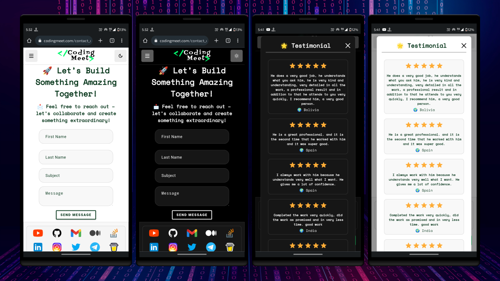

# 🚀 Coding Meet Kobweb


**Coding Meet Kobweb** is my personal portfolio website built using **Kobweb**. It showcases my projects, services, blog articles, and achievements with smooth animations and an interactive UI.

## [Try it Live](https://codingmeet.com)

</a>
</a>

## 📋 Features
✅ Portfolio showcasing projects, services, and blog articles  
✅ Achievements highlighting YouTube, GitHub, and Fiverr milestones  
✅ Interactive UI with smooth animations and transitions  
✅ Contact form with social media links  
✅ Built with **Kobweb** for enhanced performance and SEO

## Technology Stack
1. [Kotlin](https://kotlinlang.org/) - Kotlin is a modern programming language that makes developers happier and more productive.
2. [Compose HTML](https://github.com/JetBrains/compose-multiplatform#:~:text=Libraries-,Compose%20HTML,-Compose%20HTML%20is) - Compose HTML is a library for creating web user interfaces with HTML and CSS.
3. [Kobweb](https://github.com/varabyte/kobweb) - An opinionated Kotlin framework for creating web apps. It is built on top of Compose HTML.


## Getting Started

### Installation 🛠️

1. Clone this repository:
   ```bash
   git clone https://github.com/Coding-Meet/Porfolio-Kobweb.git
   ```

3. Follow the [Kobweb](https://kobweb.varabyte.com/docs/getting-started/getting-kobweb) Installation Guide to set up Kobweb in your system.
2. Open in the latest version of IntelliJ IDEA Community Edition.
4. Run the development server by typing the following command in a terminal under the `site` folder:

```bash
  $ cd site
  $ kobweb run
```
5. Open your browser and visit: http://localhost:8080

## 📸 Screenshots

<table>
  <tr>
    <td></td>
      </tr>
  <tr>
    <td></td>
  </tr>
  <tr>
    <td></td>
      </tr>
  <tr>
    <td></td>
  </tr>
  <tr>
    <td></td>
      </tr>
  <tr>
    <td></td>
  </tr>
  <tr>
    <td></td>
      </tr>
  <tr>
    <td></td>
  </tr>

</table>

## ❤ Show your support

Give a ⭐️ if this project helped you!

<a href="https://www.buymeacoffee.com/codingmeet" target="_blank">

</a>

Your generosity is greatly appreciated! Thank you for supporting this project.

## Connect with me

[](https://youtube.com/@CodingMeet26?si=FuKwU-aBaf_5kukR)
[](https://www.linkedin.com/in/coding-meet-a74933273/)
[](https://twitter.com/CodingMeet)

## Author

**Meet**